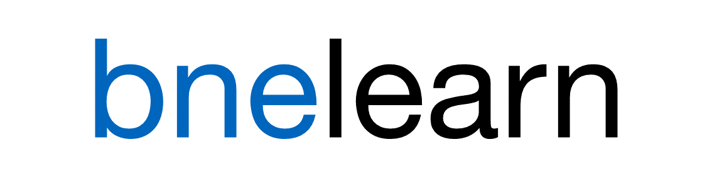

# A Framework for Equilibrium Learning in Sealed-Bid Auctions

[](https://gitlab.lrz.de/heidekrueger/bnelearn/commits/master) | [](https://gitlab.lrz.de/heidekrueger/bnelearn/commits/master)

Authors: Stefan Heidekrüger ([@heidekrueger](https://github.com/heidekrueger)), Paul Sutterer, Nils Kohring ([@kohring](https://github.com/kohring)), Martin Bichler

Currently, this repository contains minimal code to reproduce the experiments in our forthcoming paper: "Learning Equilibria in Symmetric Auction Games using Artificial Neural Networks", published in _Nature Machine Intelligence_ [Link](https://www.nature.com/articles/s42256-021-00365-4).

#### Overview of What's Implemented

Running experiments for $n$-player Matrix and sealed-bid auction Games with either

* Fictitious Play, Stochastic Fictitious Play, Mixed Fictitious Play in matrix games
* "Neural Pseudogradient Ascent" in a wide array of Auction games:
  * single-item auctions with first-, second- and third-price rules, with known-bne support for a wide range of settings.
  * Local-Global combinatorial auctions, in particular LLG and LLLLGG
    * for LLG we support bne for independent and correlated local bidders for several core-selecting payment rules
  * split-award and mineral-rights auctions
  
**TODO:** Update.

#### Table of Contents
1. [Installation](#Installation)
2. [Background](#Background)
3. [The bnelearn package](#package)
4. [Contribute](#Contribute)
5. [Citation](#Citation)

## 1. Installation and Running the Software <a name="Installation"></a>
See [Installation](installation.md).

**TODO:** With what's on Github.

**TODO:** Add example of customization.

## 2. Background <a name="Background"></a>

The computation and analysis of equilibrium states in strategic settings is of utmost importance in the economic sciences. However, equilibria in many markets remain poorly understood. The computational complexity of finding Nash equilibria is known to be PPAD complete even for finite normal form games (NFG), a class that is considered to be hard unless P = NP \citep{daskalakis2009ComplexityComputingNash}. Despite these hardness results for the worst case, equilibrium computation has become tenable for NFGs of moderate sizes in recent years. \todoi{add some details and references.} Auction markets are of a particular interest to economists and policymakers, as a precise understanding of strategic behavior in proposed auction markets would be invaluable in the design and implementation market mechanisms with certain desiderata. However, the game theoretic properties of auctions are even less amiable to equilibrium computation: Auctions are commonly modeled as Bayesian games with continuous type and action spaces \cite{harsanyi1968GamesIncompleteInformationb}, resulting in an infinite-dimensional, functional space of possible strategies. Such games are no longer finite, so even Nash's famous theorem about the existence of equilibria \cite{nash1950EquilibriumPointsNperson} no longer holds, and the complexity of finding Bayesian Nash equilibria in auctions may be NP-hard or worse depending on the specifics of the game. In fact, \citet{cai2014SimultaneousBayesianAuctions} show that in certain combinatorial auctions, the computation of Bayesian Nash (BNE) is at least PP-hard (a complexity class above the polynomial hierarchy), and even certifying or approximating a BNE at a constant approximation bound remains NP-hard. The current understanding of strategic behavior in the field of auction theory therefore relies mainly on equilibria that have been analytically derived. Unfortunately, such results are scarce and elusive for all but a few simple settings. 

Most recently, however, there have been a range of first empirical successes in approximating Bayesian Nash equilibria in sealed-bid auctions using computational black-box methods that do not rely on manual mathematical analysis of specific settings \cite{heymann2021HeuristicEstimatingNash,bichler2021LearningEquilibriaSymmetric,bosshard2020ComputingBayesNashEquilibria,li2021EvolutionStrategiesApproximate}. This suggests that the established hardness results may not apply to a wide range of auctions that are of practical interest and that it may be possible to characterize subclasses of continuous Bayesian games for which equilibrium computation may be feasible.

However, the literature on auctions is vast, with many variants of markets that are of interest. This has been a limiting factor for research in equilibrium computation, as each individual study has only been able to investigate new methods in a small number of relevant auction settings due to implementation complexity. Existing equilibrium learning methods rely on simulating very large numbers of auctions, which has required computational optimizations that have often been hand tailored to specific classes of auctions or even the specific setting at hand.

To facilitate future research in equilibrium computation in auctions, we propose consolidating a wide set of auction settings into a single benchmark suite with a common, modular, extensible and performant programming interface. To this end, we present our open-source package _bnelearn}, which provides a GPU-accelerated framework for equilibrium computation in sealed-bid auctions and related (Bayesian and complete-information) games. Using _bnelearn}, researchers working on novel equilibrium learning rules will have access to a wide selection of implemented auction settings with or without existing equilibria as well as to an ecosystem of metrics and tools that facilitate analysis. To the authors' knowledge, _bnelearn} comprises the largest and most complete suite of implementations of sealed-bid auctions and their known equilibria, collecting 

In addition to researchers in equilibrium computation, we expect that such a framework will also be useful to practitioners of auction theory in the economic sciences: Given the fact that existing approaches have been empirically demonstrated to converge to approximate equilibria in a wide range of auction settings, and (approximate) error bounds can be calculated for candidate solutions, _bnelearn} enables analyses of strategic behavior in markets that elude analytical equilibrium analysis. As an example, in \cite{bichler2021LearningEquilibriaSymmetric}, we were empirically able to quantify the effects of correlation between bidders on revenue and economic efficiency in equilibrium of small combinatorial auctions with core-selecting payment rules.


### Problem Statement
#### Model of an Auction Game

We consider _sealed-bid_ auctions as special cases of Bayesian games. In such games, an auctioneer aims to sell $m$ goods to $n$ competing buyers. These buyers each submit bids based on their private information. Based on these bids, the auctioneer then uses an _auction mechanism} to allocate the goods to the buyers and determine what prices to charge the winners. The most general case of such an auction game can be formalized as the tuple $G = (n, m, \mathcal{V}, \mathcal{O}, F, \mathcal{A}, x, p, u)$, where
* $n$ is the number of participating _bidders_ or _agents_. We denote the set of bidders by $\mathcal{I} = \lbrace 1, \dots, n\rbrace$ and use the letter $i$ to index it.
* $m$ is the number of _goods} to be sold. When goods are heterogenous, we further denote by $\mathcal{K} = 2^{[m]}$ the set of _bundles} of goods, and index it by $k$. When goods are homogenous, we instead use $\mathcal{K} = {[m]} \cup \{0\}$ to describe the possible cardinalities of subsets of the goods.
* $\mathcal{V} = \mathcal{V}_1 \times \dots \times \mathcal{V}_n$ describes the set of possible _valuations_ of the bidders: Each bidder $i$ may be potentially interested in a subset $\mathcal{K}_i \subseteq \mathcal{K}$ of the possible bundles. Writing $K_i = \left\lvert \mathcal{K}_i \right\rvert$ for it's cardinality, $\mathcal{V}_i \subseteq \R^{K_i}_{+}$ then is the set of possible _valuation vectors_ for agent $i$. For example, in an auction of two heterogenous items $\{a, b\}$, we might have $\mathcal{V}_i = \R^4_+$ and a vector $v_i = (0, 1, 2, 5)$ would indicate agent $i$'s valuations for winning the empty bundle, only item $a$, only item $b$, or both items, respectively. Note that in some cases, bidders may not directly observe their true valuations $v_i$, but may only have access to partial information about them:
* $\mathcal{O} = \mathcal{O}_1 \times \dots \times \mathcal{O}_n$ describes the set of possible _signals} or observations of private information that the bidders have access to. In the _private values} model, where bidders have full information about their valuations, we have $o_i = v_i$.
* $F$ is the cumulative density function of the joint _prior} distribution over bidders' types, given by tuples $(o_i, v_i)$ of observations and valuations: $F: \mathcal V \times \mathcal O \rightarrow [0, 1]$. It's probability density function will be denoted by $f$ and we state no further assumptions on the prior, thus, allowing for arbitrary correlations. Its marginals are denoted by $f_v$, $f_{o_i}$, etc. and its conditionals by $f_{v_i\vert o_i}$.
* $\mathcal{A} = \mathcal{A}_1 \times \dots \times \mathcal{A}_n = \mathbb{R}^n_{\geq 0}$ are the available actions or _bids} to the bidders. These must be decided on based on the strategy $\beta_i$ and the information they have available, namely their observations $o_i$: $\beta_i(o_i) = b_i$.
* \todo[inline]{Strategies?}
* $x = (x_1, \dots, x_n) \in \{0, 1\}^{|\mathcal K|}$ and $p = (p_1, \dots, p_n) \in \R^n$ describe the allocations and the payments that are determined by the mechanism after bids $b \in \mathcal{A}$ have been reported. An allocation constitutes a partition of the $m$ items, where bidder $i$ is allocated the bundle $x_i$. In the simplest case, the allocations would be chosen such that the seller revenue (the sum of all bidders' payments) is maximized when bidders pay what they report. This is known as the first-price sealed bid auction.
* $u = (u_1, \dots, u_n)$ then is the utility vector of the bidders, where bidder $i$'s utility $u_i(v_i, b)$ depends on their own valuation but all bidders' actions. Assuming the other bidders follow $\beta$, bidder $i$'s _interim utility} is then defined as the expected utility of choosing a bid $b_i$ conditioned on their observation $o_i$:
$$\overline{u}_i(o,b_i,\beta_{-i}) = \mathbb{E}_{v_i,o_{-i}|o_i}\left[u_i(v_i, b_i,\beta_{-i}(o_{-i}))\right].$$
Accordingly, the interim _utility loss_ $\overline \ell$ that is incurred by not playing a best response is:
$$\overline \ell (o; b_i, \beta_{-i}) = \sup_{b'_i \in \mathcal A_i} \overline u_i(o_i, b'_i, \beta_{-i}) -\overline u_i(o_i, b_i, \beta_{-i}).$$
Furthermore, the _ex-ante utility_ is defined as $\tilde{u}_i(\beta_i,\beta_{-i})=\mathbb{E}_{o_i \sim f_{o_i}} [\overline{u}_i(o_i, \beta_{i}(o_i), \beta_{-i})]$, and the _ex-ante loss_ $\tilde \ell_i(\beta_i, \beta_{-i})$.

The question to be answered now is: "What is the optimal strategy profile for the bidders?" The most common the solution concept for this question is the so-called Bayes-Nash equilibrium: An _(interim) $\epsilon$-Bayes-Nash equilibrium ($\epsilon$-BNE)_ is a strategy profile $\beta^* = (\beta^*_1, \dots, \beta^*_n)$ such that no agent can improve their own utility by more than $\epsilon \geq 0$ by unilaterally deviating from $\beta^*$:
$$\forall\ i\in\mathcal I, o_i \in \mathcal O_i: \quad \overline{\ell}_i\left(o_i; \beta^*_i(o_i), \beta^*_{-i}\right)  \leq  \epsilon.$$
For $\epsilon = 0$, the BNE is called _exact_, or the $\epsilon$-prefix is simply dropped. The  _ex-ante $\epsilon$-BNE_ is defined analogously.


### Related Literature

There is a large body of work on learning in games. However, the closer one comes to the modeling of auction games---continues type- and action spaces, general-sum games, non differentiable utility functions---less and less theoretical results or just heuristic learning approaches exist.

For rather small auction settings and under further assumptions, one is able to derive equilibria analytically for specific settings. Some fundamental results are listed by \citet{krishna2009AuctionTheory}.

#### Methods for Equilibrium Learning
Equilibrium learning is now concerned with finding an optimal strategy profile for the agents. Where optimality is generally defined as the profile being a Bayes-Nash equilibrium. It has been shown that finding exact equilibria for these types of games with continuous state and action spaces is a computationally hard problem. However, \cite{bichler2021LearningEquilibriaSymmetric} were able to provably approximate equilibria in auction games under symmetry assumptions.

\todo[inline]{Adapted from old journal version:} Earlier approaches to compute auction game equilibria approximately either comprised solving the set of differential equations resulting from the first order conditions of simultaneous maximization of the bidders' payoffs \citep{marshall1994numerical, bajari2001comparing}, or of restricting the action space, usually by discretization \citep{athey2001single}. \citet{armantier2008ApproximationNashEquilibria} introduced a general BNE computation method that is based on expressing the Bayesian game as the limit of a sequence of complete information games. Defining this sequence, however, also requires setting specific analysis. More recently, research in machine learning contributed to learning good bidding strategies in repeated revenue maximizing auctions \citep{nedelec2019learning}. \citet{bosshard2017ComputingBayesNashEquilibria,bosshardComputingBayesNashEquilibria2018} were first to compute equilibria in more complex combinatorial auctions. Their approach explicitly computes point-wise best responses in a fine grained linearization of the strategy space via sophisticated Monte-Carlo integration. Assuming independent priors and risk neutral utility functions, their verification method guarantees an upper bound $\epsilon$ on the interim loss in utility, thus provably finding an $\epsilon$-BNE.

#### Existing Multi-Agent Learning Packages
Other multi-agent learning frameworks, such as OpenSpiel \citep{lanctotEtAl2019OpenSpiel} that is a collection of games and algorithms for reinforcement learning and planning or PettingZoo \citep{terry2020pettingzoo} that is a multi-agent extension of the famous OpenAI Gym framework \citep{OpenAIGym}, mainly focus on zero-sum games and on games with discrete action spaces. Crucially, they neither allow an efficient evaluation of running a large batch of games in parallel.


## 3. The bnelearn Package <a name="package"></a>
In this section, we will present the _bnelearn} package with its most essential features and the auction games and learning algorithms it contains.

#### Structure and Features
* I(PV) and non-PV (e.g. common values), with arbitrary priors/correlation profiles, utilities, valuation/observation/bid dimensionalities.
* modular organization allows for easy construction of new markets (e.g. bid languages / ...) from existing or custom building blocks
* extensive metrics (learning-related: estimates of "equilibrium quality", utilities over time, market analysis: efficiency, revenue, individual payoffs) and built-in plotting capacities.
* wide range of predefined settings and building blocks. (Learning rules: NPGA, PSO, Bosshards(???), Auctions (...), Priors/Correlations (...), utility functions, ...)


* fully vectorized, cuda enabled, massive parallelism
* Variance Reduction easy-to-use built-in / Quasirandom sampling (not yet implemented, but should be easy)
* for combinatorial auctions: custom batched, cuda-enabled QP solver for quadratic auction rules + gurobi/cvxpy integration for arbitrary auctions stated as a MIP.


Limitations: (same dimensionality for all players. Current implementations and learners use deterministic/pure continuous actions.)

#### Predefined Auction Settings
A diverse set of auction games is implemented in the framework.

#### Predefined Learners
Algorithms for trying to iteratively learn equilibria implement the base class `Learner` in the framework. Two noteworthy algorithms that are contained are (i.) neural self-play with directly computed policy gradients from \cite{heinrich2016deep}, which is called `PGLearner`, and (ii.) neural pseudogradient ascent, `ESPGLearner`, from \cite{bichler2021LearningEquilibriaSymmetric}

**TODO:** Add PSO.


## 4. Contribute: Before Your First Commit <a name="Contribute"></a>
Please read [Contributing](contributing.md) carefully and follow the set-up steps described there.

#### Git LFS
On a new machine, please make sure you have git-lfs installed and configured for this repository. (See [contributing.md](contributing.md) for details.)


## 5. Suggested Citation <a name="Citation"></a>
If you find `bnelearn` helpful and use it in your work, please consider using the following citation:

```
@misc{Heidekrueger2021,
  author = {Heidekr\"uger, Stefan and Kohring, Nils and Sutterer, Paul and Bichler, Martin},
  title = {{bnelearn}: A Framework for Equilibrium Learning in Sealed-Bid Auctions},
  year = {2021},
  publisher = {GitHub},
  journal = {GitHub repository},
  howpublished = {\url{https://github.com/heidekrueger/bnelearn}}
}
```
